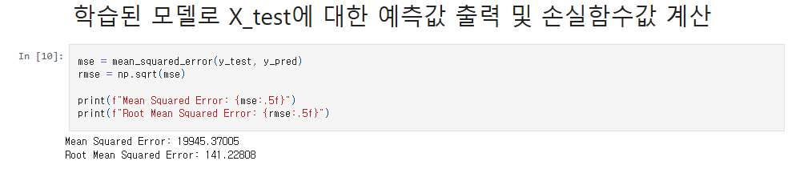
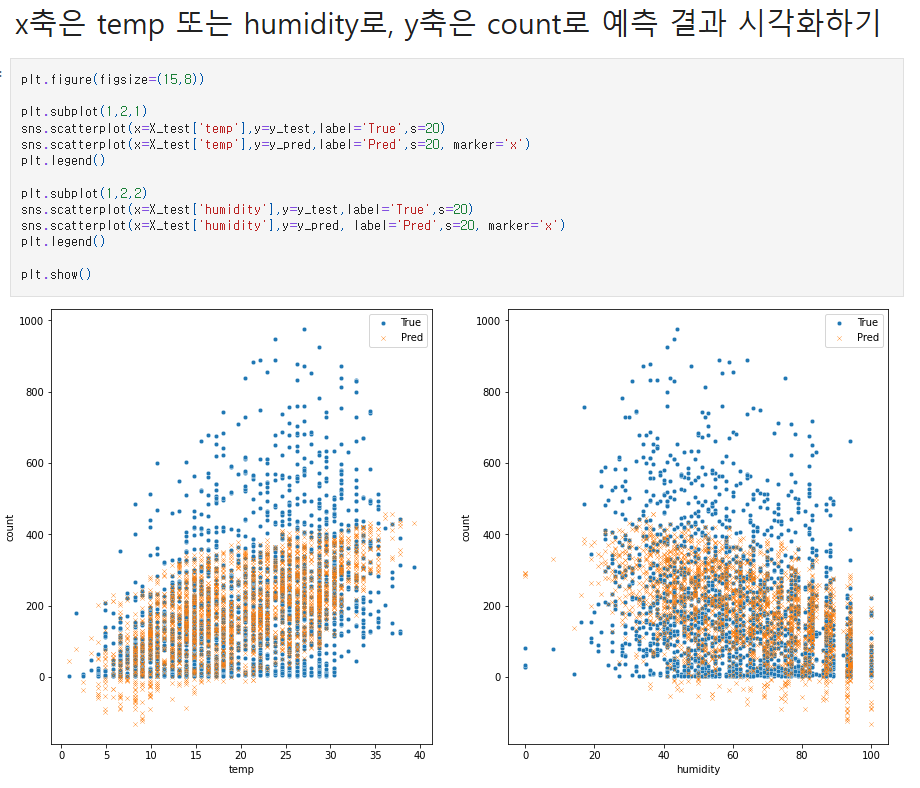

# AIFFEL Campus Online Code Peer Review Templete
- 코더 : 박민경
- 리뷰어 : 김성훈


# PRT(Peer Review Template)
- [x]  **1. 주어진 문제를 해결하는 완성된 코드가 제출되었나요?**  
        - 9-1의 결과물 (MSE 손실함수값 3000 이하를 달성)  
          
        - 9-2의 결과물 (RMSE 값 150 이하를 달성)  
          
    
- [x]  **2. 전체 코드에서 가장 핵심적이거나 가장 복잡하고 이해하기 어려운 부분에 작성된 
주석 또는 doc string을 보고 해당 코드가 잘 이해되었나요?**
    - 전체적으로 명료한 코드로 가독성이 좋았습니다.
    - 가독성 좋은 코드로 크게 주석을 필요로 하지 않을 정도였고 딱 필요한 부분에는 간단하게 작성한 주석으로 충분히 이해를 도왔습니다.
    
    특이 이 부분에서는 다수의 데이터가 밀집하여 y값과 예측값이 겹치는 부분이 다소 보기 어려운 부분이었는데, 마커의 크기와 모양을 설정하여 좀 더 보기 좋게 시각화한 점이 굉장히 좋았다.

        
- [ ]  **3. 에러가 난 부분을 디버깅하여 문제를 해결한 기록을 남겼거나
새로운 시도 또는 추가 실험을 수행해봤나요?**

        
- [ ]  **4. 회고를 잘 작성했나요?**

        
- [x]  **5. 코드가 간결하고 효율적인가요?**
    
    - 필요한 패키지를 최상단에 다 불러놓고 시작하여 이후 코드 블럭에서 코드가 더 간결하고 내용에 더 집중할 수 있었던 점이 좋았습니다.
    
    
    - 함수 부분들은 따로 모아서 한 셀에 작성한다든가, 전체적으로 간결하고 명료한 문서였습니다.

# 회고(참고 링크 및 코드 개선)
```
장황했던 나와는 달리 굉장히 간단 명료하고 깔끔하게 보기 좋은 코드들도 좋았는데 시각화 자료까지도 보기가 좋았다.
나도 다른 사람이 보고 이해하기 쉽고 깔끔하게 작성하도록 해야겠다는 생각이 들게하는 좋은 자료였다.
```
